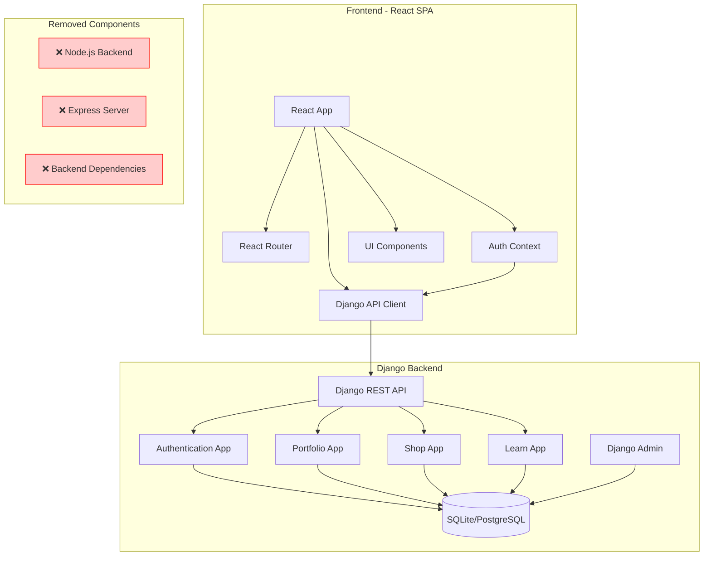

# Design Document

## Overview

This design document outlines the technical approach for completely migrating the React frontend from any previous backend dependencies to the existing Django backend. The design focuses on removing all traces of the previous Node.js/Express backend and establishing a clean, efficient integration with Django's REST API endpoints. The frontend will maintain its existing UI/UX while gaining full dynamic functionality through Django's comprehensive API.

### Design Principles

1. **Clean Migration** - Remove all previous backend code and dependencies completely
2. **Django-First Integration** - Design all API interactions specifically for Django REST framework
3. **Maintain UI/UX** - Preserve existing design and user experience
4. **Authentication Security** - Implement secure JWT-based authentication with Django
5. **Performance Optimization** - Efficient data fetching and caching strategies

## Architecture

### High-Level System Architecture



### Technology Stack

**Frontend (Unchanged):**
- React 19.1.1 with React Router DOM 7.8.2
- Tailwind CSS 3.4.17 for styling
- Vite 7.1.2 for build tooling
- React Context API for global state management
- Axios for HTTP requests to Django

**Backend (Django - Already Implemented):**
- Django 4.2.7 with Django REST Framework 3.14.0
- SQLite for development (PostgreSQL for production)
- JWT authentication with custom User model
- Django Admin for content management
- CORS headers configured for frontend

**Removed Components:**
- All Node.js/Express backend files
- Backend-related npm packages
- Previous API client configurations
- Old authentication implementations

## Components and Interfaces

### Django API Endpoints Integration

#### 1. Authentication Endpoints

**Django URLs:**
```
POST /api/auth/register/     - User registration
POST /api/auth/login/        - User login  
POST /api/auth/logout/       - User logout
GET  /api/auth/me/           - Get current user
POST /api/auth/refresh/      - Refresh JWT token
```

**Frontend Integration:**
```javascript
// src/utils/djangoApi.js
const API_BASE_URL = import.meta.env.VITE_DJANGO_API_URL || 'http://localhost:8000';

const djangoApi = axios.create({
  baseURL: API_BASE_URL,
  headers: {
    'Content-Type': 'application/json',
  },
});

// Authentication methods
export const authAPI = {
  register: (userData) => djangoApi.post('/api/auth/register/', userData),
  login: (credentials) => djangoApi.post('/api/auth/login/', credentials),
  logout: () => djangoApi.post('/api/auth/logout/'),
  getCurrentUser: () => djangoApi.get('/api/auth/me/'),
  refreshToken: () => djangoApi.post('/api/auth/refresh/'),
};
```

#### 2. Portfolio Content Endpoints

**Django URLs:**
```
GET /api/portfolio/projects/          - List projects (with pagination)
GET /api/portfolio/projects/{id}/     - Get single project
GET /api/portfolio/thoughts/          - List thoughts (with pagination)  
GET /api/portfolio/thoughts/{id}/     - Get single thought
GET /api/portfolio/work/              - List work experience
```

**Frontend Integration:**
```javascript
// Portfolio API methods
export const portfolioAPI = {
  getProjects: (params = {}) => djangoApi.get('/api/portfolio/projects/', { params }),
  getProject: (id) => djangoApi.get(`/api/portfolio/projects/${id}/`),
  getThoughts: (params = {}) => djangoApi.get('/api/portfolio/thoughts/', { params }),
  getThought: (id) => djangoApi.get(`/api/portfolio/thoughts/${id}/`),
  getWorkExperience: () => djangoApi.get('/api/portfolio/work/'),
};
```

#### 3. Learn Platform Endpoints

**Django URLs:**
```
GET  /api/learn/courses/                    - List courses
GET  /api/learn/courses/{id}/               - Get course details
POST /api/learn/courses/{id}/enroll/        - Enroll in course
GET  /api/learn/lessons/{id}/               - Get lesson details
POST /api/learn/lessons/{id}/complete/      - Mark lesson complete
GET  /api/learn/assignments/{id}/           - Get assignment details
POST /api/learn/assignments/{id}/submit/    - Submit assignment
GET  /api/learn/assignments/{id}/submissions/ - Get public submissions
POST /api/learn/submissions/{id}/comments/  - Add comment to submission
```

**Frontend Integration:**
```javascript
// Learn platform API methods
export const learnAPI = {
  getCourses: () => djangoApi.get('/api/learn/courses/'),
  getCourse: (id) => djangoApi.get(`/api/learn/courses/${id}/`),
  enrollInCourse: (id) => djangoApi.post(`/api/learn/courses/${id}/enroll/`),
  getLesson: (id) => djangoApi.get(`/api/learn/lessons/${id}/`),
  completeLesson: (id) => djangoApi.post(`/api/learn/lessons/${id}/complete/`),
  getAssignment: (id) => djangoApi.get(`/api/learn/assignments/${id}/`),
  submitAssignment: (id, data) => djangoApi.post(`/api/learn/assignments/${id}/submit/`, data),
  getSubmissions: (assignmentId) => djangoApi.get(`/api/learn/assignments/${assignmentId}/submissions/`),
  addComment: (submissionId, comment) => djangoApi.post(`/api/learn/submissions/${submissionId}/comments/`, comment),
};
```

#### 4. Shop Endpoints (Future Use)

**Django URLs:**
```
GET  /api/shop/products/     - List products
GET  /api/shop/cart/         - Get user cart
POST /api/shop/cart/add/     - Add to cart
POST /api/shop/orders/       - Create order
```

Note: Shop endpoints exist in Django but frontend will continue showing "Coming Soon" page.

### Frontend Component Updates

#### 1. Authentication Context (Updated)

```javascript
// src/context/AuthContext.jsx
const AuthContext = createContext();

export const AuthProvider = ({ children }) => {
  const [user, setUser] = useState(null);
  const [isAuthenticated, setIsAuthenticated] = useState(false);
  const [isLoading, setIsLoading] = useState(true);

  // Updated to use Django API
  const login = async (email, password) => {
    try {
      const response = await authAPI.login({ email, password });
      const { access_token, refresh_token, user } = response.data;
      
      // Store tokens securely
      localStorage.setItem('access_token', access_token);
      localStorage.setItem('refresh_token', refresh_token);
      
      setUser(user);
      setIsAuthenticated(true);
      
      return user;
    } catch (error) {
      throw new Error(error.response?.data?.message || 'Login failed');
    }
  };

  const register = async (email, password, display_name) => {
    try {
      const response = await authAPI.register({ email, password, display_name });
      const { access_token, refresh_token, user } = response.data;
      
      localStorage.setItem('access_token', access_token);
      localStorage.setItem('refresh_token', refresh_token);
      
      setUser(user);
      setIsAuthenticated(true);
      
      return user;
    } catch (error) {
      throw new Error(error.response?.data?.message || 'Registration failed');
    }
  };

  const logout = async () => {
    try {
      await authAPI.logout();
    } catch (error) {
      console.error('Logout error:', error);
    } finally {
      localStorage.removeItem('access_token');
      localStorage.removeItem('refresh_token');
      setUser(null);
      setIsAuthenticated(false);
    }
  };

  // Auto-login on app start
  useEffect(() => {
    const initAuth = async () => {
      const token = localStorage.getItem('access_token');
      if (token) {
        try {
          const response = await authAPI.getCurrentUser();
          setUser(response.data);
          setIsAuthenticated(true);
        } catch (error) {
          // Token invalid, clear storage
          localStorage.removeItem('access_token');
          localStorage.removeItem('refresh_token');
        }
      }
      setIsLoading(false);
    };

    initAuth();
  }, []);

  return (
    <AuthContext.Provider value={{
      user,
      isAuthenticated,
      isLoading,
      login,
      register,
      logout,
    }}>
      {children}
    </AuthContext.Provider>
  );
};
```

#### 2. Data Fetching Hooks (Updated for Django)

```javascript
// src/hooks/useProjects.js
export const useProjects = (featured = false, limit = null) => {
  const [projects, setProjects] = useState([]);
  const [loading, setLoading] = useState(true);
  const [error, setError] = useState(null);

  useEffect(() => {
    const fetchProjects = async () => {
      try {
        setLoading(true);
        const params = {};
        if (featured) params.featured = true;
        if (limit) params.limit = limit;
        
        const response = await portfolioAPI.getProjects(params);
        
        // Handle Django pagination format
        const projectsData = response.data.results || response.data;
        setProjects(projectsData);
        setError(null);
      } catch (err) {
        setError(err.message);
        setProjects([]);
      } finally {
        setLoading(false);
      }
    };

    fetchProjects();
  }, [featured, limit]);

  return { projects, loading, error, refetch: fetchProjects };
};

// Similar updates for useThoughts and useWorkExperience
```

#### 3. Learn Platform Components (Updated)

```javascript
// src/components/CoursesList.jsx
const CoursesList = () => {
  const [courses, setCourses] = useState([]);
  const [loading, setLoading] = useState(true);
  const [error, setError] = useState(null);

  useEffect(() => {
    const fetchCourses = async () => {
      try {
        const response = await learnAPI.getCourses();
        setCourses(response.data.results || response.data);
      } catch (err) {
        setError('Failed to load courses');
      } finally {
        setLoading(false);
      }
    };

    fetchCourses();
  }, []);

  if (loading) return <SkeletonLoader type="card" count={3} />;
  if (error) return <ErrorMessage message={error} onRetry={() => window.location.reload()} />;

  return (
    <div className="grid gap-6 md:grid-cols-2 lg:grid-cols-3">
      {courses.map(course => (
        <CourseCard key={course.id} course={course} />
      ))}
    </div>
  );
};
```

#### 4. Assignment Submission Form (Updated)

```javascript
// src/components/AssignmentSubmissionForm.jsx
const AssignmentSubmissionForm = ({ assignment, existingSubmission, onSubmit }) => {
  const [formData, setFormData] = useState({
    github_repo_url: existingSubmission?.github_repo_url || '',
    live_preview_url: existingSubmission?.live_preview_url || '',
    notes: existingSubmission?.notes || '',
    is_public: existingSubmission?.is_public ?? true,
  });
  const [loading, setLoading] = useState(false);
  const [error, setError] = useState(null);

  const handleSubmit = async (e) => {
    e.preventDefault();
    setLoading(true);
    setError(null);

    try {
      await learnAPI.submitAssignment(assignment.id, formData);
      onSubmit();
      toast.success('Assignment submitted successfully!');
    } catch (err) {
      setError(err.response?.data?.message || 'Submission failed');
    } finally {
      setLoading(false);
    }
  };

  return (
    <form onSubmit={handleSubmit} className="space-y-4">
      <div>
        <label htmlFor="github_repo_url" className="block text-sm font-medium text-gray-700">
          GitHub Repository URL (Optional)
        </label>
        <input
          type="url"
          id="github_repo_url"
          value={formData.github_repo_url}
          onChange={(e) => setFormData(prev => ({ ...prev, github_repo_url: e.target.value }))}
          className="mt-1 block w-full rounded-md border-gray-300 shadow-sm focus:border-indigo-500 focus:ring-indigo-500"
          placeholder="https://github.com/username/repo"
        />
      </div>

      <div>
        <label htmlFor="live_preview_url" className="block text-sm font-medium text-gray-700">
          Live Preview URL (Optional)
        </label>
        <input
          type="url"
          id="live_preview_url"
          value={formData.live_preview_url}
          onChange={(e) => setFormData(prev => ({ ...prev, live_preview_url: e.target.value }))}
          className="mt-1 block w-full rounded-md border-gray-300 shadow-sm focus:border-indigo-500 focus:ring-indigo-500"
          placeholder="https://your-project.netlify.app"
        />
      </div>

      <div>
        <label htmlFor="notes" className="block text-sm font-medium text-gray-700">
          Notes (Optional)
        </label>
        <textarea
          id="notes"
          rows={4}
          value={formData.notes}
          onChange={(e) => setFormData(prev => ({ ...prev, notes: e.target.value }))}
          className="mt-1 block w-full rounded-md border-gray-300 shadow-sm focus:border-indigo-500 focus:ring-indigo-500"
          placeholder="Any notes about your submission..."
        />
      </div>

      <div className="flex items-center">
        <input
          type="checkbox"
          id="is_public"
          checked={formData.is_public}
          onChange={(e) => setFormData(prev => ({ ...prev, is_public: e.target.checked }))}
          className="h-4 w-4 text-indigo-600 focus:ring-indigo-500 border-gray-300 rounded"
        />
        <label htmlFor="is_public" className="ml-2 block text-sm text-gray-900">
          Make submission public (other students can see it)
        </label>
      </div>

      {error && <ErrorMessage message={error} />}

      <button
        type="submit"
        disabled={loading}
        className="w-full flex justify-center py-2 px-4 border border-transparent rounded-md shadow-sm text-sm font-medium text-white bg-indigo-600 hover:bg-indigo-700 focus:outline-none focus:ring-2 focus:ring-offset-2 focus:ring-indigo-500 disabled:opacity-50"
      >
        {loading ? 'Submitting...' : existingSubmission ? 'Update Submission' : 'Submit Assignment'}
      </button>
    </form>
  );
};
```

## Data Models and Format Handling

### Django Response Format Handling

#### 1. Pagination Format

Django REST framework uses this pagination format:
```json
{
  "count": 25,
  "next": "http://localhost:8000/api/portfolio/projects/?page=2",
  "previous": null,
  "results": [
    // ... project objects
  ]
}
```

Frontend handling:
```javascript
const handlePaginatedResponse = (response) => {
  return {
    items: response.data.results || response.data,
    count: response.data.count,
    next: response.data.next,
    previous: response.data.previous,
  };
};
```

#### 2. Error Format

Django REST framework error format:
```json
{
  "field_name": ["This field is required."],
  "non_field_errors": ["Invalid credentials."]
}
```

Frontend error handling:
```javascript
const handleDjangoErrors = (error) => {
  if (error.response?.data) {
    const errors = error.response.data;
    
    // Handle field-specific errors
    if (typeof errors === 'object') {
      const fieldErrors = {};
      Object.keys(errors).forEach(field => {
        fieldErrors[field] = Array.isArray(errors[field]) 
          ? errors[field][0] 
          : errors[field];
      });
      return fieldErrors;
    }
    
    // Handle general errors
    return { general: errors.detail || errors.message || 'An error occurred' };
  }
  
  return { general: 'Network error occurred' };
};
```

#### 3. Date Format Handling

Django returns ISO format dates:
```json
{
  "created_at": "2024-01-15T10:30:00Z",
  "date": "2024-01-15"
}
```

Frontend date handling:
```javascript
const formatDate = (dateString) => {
  return new Date(dateString).toLocaleDateString('en-US', {
    year: 'numeric',
    month: 'long',
    day: 'numeric'
  });
};
```

## Authentication and Security

### JWT Token Management

#### 1. Token Storage and Refresh

```javascript
// src/utils/tokenManager.js
class TokenManager {
  static getAccessToken() {
    return localStorage.getItem('access_token');
  }

  static getRefreshToken() {
    return localStorage.getItem('refresh_token');
  }

  static setTokens(accessToken, refreshToken) {
    localStorage.setItem('access_token', accessToken);
    localStorage.setItem('refresh_token', refreshToken);
  }

  static clearTokens() {
    localStorage.removeItem('access_token');
    localStorage.removeItem('refresh_token');
  }

  static async refreshAccessToken() {
    const refreshToken = this.getRefreshToken();
    if (!refreshToken) {
      throw new Error('No refresh token available');
    }

    try {
      const response = await authAPI.refreshToken();
      const { access_token } = response.data;
      localStorage.setItem('access_token', access_token);
      return access_token;
    } catch (error) {
      this.clearTokens();
      throw error;
    }
  }
}
```

#### 2. Axios Interceptors for Django

```javascript
// src/utils/djangoApi.js
// Request interceptor to add auth token
djangoApi.interceptors.request.use(
  (config) => {
    const token = TokenManager.getAccessToken();
    if (token) {
      config.headers.Authorization = `Bearer ${token}`;
    }
    return config;
  },
  (error) => Promise.reject(error)
);

// Response interceptor to handle token refresh
djangoApi.interceptors.response.use(
  (response) => response,
  async (error) => {
    const originalRequest = error.config;

    if (error.response?.status === 401 && !originalRequest._retry) {
      originalRequest._retry = true;

      try {
        const newToken = await TokenManager.refreshAccessToken();
        originalRequest.headers.Authorization = `Bearer ${newToken}`;
        return djangoApi(originalRequest);
      } catch (refreshError) {
        // Refresh failed, redirect to login
        window.location.href = '/login';
        return Promise.reject(refreshError);
      }
    }

    return Promise.reject(error);
  }
);
```

## Error Handling Strategy

### 1. API Error Handling

```javascript
// src/utils/errorHandler.js
export const handleAPIError = (error) => {
  if (error.response) {
    const { status, data } = error.response;
    
    switch (status) {
      case 400:
        return { type: 'validation', message: 'Please check your input', details: data };
      case 401:
        return { type: 'auth', message: 'Please log in to continue' };
      case 403:
        return { type: 'permission', message: 'You do not have permission to perform this action' };
      case 404:
        return { type: 'notfound', message: 'The requested resource was not found' };
      case 500:
        return { type: 'server', message: 'Server error occurred. Please try again later.' };
      default:
        return { type: 'unknown', message: 'An unexpected error occurred' };
    }
  }
  
  if (error.request) {
    return { type: 'network', message: 'Network error. Please check your connection.' };
  }
  
  return { type: 'unknown', message: error.message || 'An error occurred' };
};
```

### 2. Error Boundary for Django Integration

```javascript
// src/components/ErrorBoundary.jsx
class ErrorBoundary extends React.Component {
  constructor(props) {
    super(props);
    this.state = { hasError: false, error: null };
  }

  static getDerivedStateFromError(error) {
    return { hasError: true, error };
  }

  componentDidCatch(error, errorInfo) {
    console.error('Django integration error:', error, errorInfo);
    
    // Log to monitoring service if available
    if (window.Sentry) {
      window.Sentry.captureException(error, { extra: errorInfo });
    }
  }

  render() {
    if (this.state.hasError) {
      return (
        <div className="min-h-screen flex items-center justify-center bg-gray-50">
          <div className="max-w-md w-full bg-white shadow-lg rounded-lg p-6">
            <div className="flex items-center justify-center w-12 h-12 mx-auto bg-red-100 rounded-full">
              <svg className="w-6 h-6 text-red-600" fill="none" stroke="currentColor" viewBox="0 0 24 24">
                <path strokeLinecap="round" strokeLinejoin="round" strokeWidth="2" d="M12 9v2m0 4h.01m-6.938 4h13.856c1.54 0 2.502-1.667 1.732-2.5L13.732 4c-.77-.833-1.964-.833-2.732 0L3.732 16.5c-.77.833.192 2.5 1.732 2.5z" />
              </svg>
            </div>
            <div className="mt-3 text-center">
              <h3 className="text-lg font-medium text-gray-900">Something went wrong</h3>
              <div className="mt-2 text-sm text-gray-500">
                There was an error connecting to the backend. Please try refreshing the page.
              </div>
              <div className="mt-4">
                <button
                  onClick={() => window.location.reload()}
                  className="inline-flex items-center px-4 py-2 border border-transparent text-sm font-medium rounded-md shadow-sm text-white bg-indigo-600 hover:bg-indigo-700 focus:outline-none focus:ring-2 focus:ring-offset-2 focus:ring-indigo-500"
                >
                  Refresh Page
                </button>
              </div>
            </div>
          </div>
        </div>
      );
    }

    return this.props.children;
  }
}
```

## Performance Optimization

### 1. Data Caching Strategy

```javascript
// src/hooks/useCache.js
const cache = new Map();
const CACHE_DURATION = 5 * 60 * 1000; // 5 minutes

export const useCache = (key, fetchFunction, dependencies = []) => {
  const [data, setData] = useState(null);
  const [loading, setLoading] = useState(true);
  const [error, setError] = useState(null);

  useEffect(() => {
    const fetchData = async () => {
      const cacheKey = `${key}_${JSON.stringify(dependencies)}`;
      const cached = cache.get(cacheKey);
      
      if (cached && Date.now() - cached.timestamp < CACHE_DURATION) {
        setData(cached.data);
        setLoading(false);
        return;
      }

      try {
        setLoading(true);
        const result = await fetchFunction();
        
        cache.set(cacheKey, {
          data: result,
          timestamp: Date.now(),
        });
        
        setData(result);
        setError(null);
      } catch (err) {
        setError(err);
      } finally {
        setLoading(false);
      }
    };

    fetchData();
  }, dependencies);

  return { data, loading, error };
};
```

### 2. Optimized Data Fetching

```javascript
// src/hooks/useOptimizedProjects.js
export const useOptimizedProjects = (featured = false, limit = null) => {
  return useCache(
    'projects',
    async () => {
      const params = {};
      if (featured) params.featured = true;
      if (limit) params.limit = limit;
      
      const response = await portfolioAPI.getProjects(params);
      return response.data.results || response.data;
    },
    [featured, limit]
  );
};
```

## Environment Configuration

### 1. Environment Variables

```bash
# .env.example
VITE_DJANGO_API_URL=http://localhost:8000
VITE_APP_NAME=Portfolio
VITE_ENVIRONMENT=development
```

```bash
# .env (development)
VITE_DJANGO_API_URL=http://localhost:8000
VITE_APP_NAME=Portfolio
VITE_ENVIRONMENT=development
```

```bash
# .env.production
VITE_DJANGO_API_URL=https://your-django-backend.com
VITE_APP_NAME=Portfolio
VITE_ENVIRONMENT=production
```

### 2. API Configuration

```javascript
// src/config/api.js
const config = {
  development: {
    apiUrl: 'http://localhost:8000',
    timeout: 10000,
  },
  production: {
    apiUrl: import.meta.env.VITE_DJANGO_API_URL,
    timeout: 15000,
  },
};

export const apiConfig = config[import.meta.env.VITE_ENVIRONMENT || 'development'];
```

## Migration Strategy

### Phase 1: Cleanup and Setup (Week 1)
1. Remove all Node.js backend files and dependencies
2. Update environment configuration for Django
3. Set up Django API client and authentication
4. Update AuthContext for Django integration

### Phase 2: Core Integration (Week 2)
1. Integrate portfolio content APIs (projects, thoughts, work)
2. Update Home page to fetch from Django
3. Update Projects, Thoughts, and Work pages
4. Implement error handling and loading states

### Phase 3: Learn Platform (Week 3)
1. Integrate learn platform APIs
2. Update Learn page and course components
3. Implement assignment submission system
4. Add progress tracking and comments

### Phase 4: Testing and Polish (Week 4)
1. Comprehensive testing of all integrations
2. Performance optimization and caching
3. Error handling improvements
4. Documentation updates

## Testing Strategy

### 1. API Integration Tests

```javascript
// src/utils/__tests__/djangoApi.test.js
import { authAPI, portfolioAPI, learnAPI } from '../djangoApi';

describe('Django API Integration', () => {
  test('should authenticate user successfully', async () => {
    const mockResponse = {
      data: {
        access_token: 'mock-token',
        refresh_token: 'mock-refresh',
        user: { id: 1, email: 'test@example.com' }
      }
    };
    
    jest.spyOn(authAPI, 'login').mockResolvedValue(mockResponse);
    
    const result = await authAPI.login({ email: 'test@example.com', password: 'password' });
    expect(result.data.user.email).toBe('test@example.com');
  });

  test('should fetch projects from Django API', async () => {
    const mockProjects = {
      data: {
        results: [
          { id: 1, title: 'Test Project', featured: true }
        ]
      }
    };
    
    jest.spyOn(portfolioAPI, 'getProjects').mockResolvedValue(mockProjects);
    
    const result = await portfolioAPI.getProjects({ featured: true });
    expect(result.data.results).toHaveLength(1);
  });
});
```

### 2. Component Integration Tests

```javascript
// src/components/__tests__/CoursesList.test.jsx
import { render, screen, waitFor } from '@testing-library/react';
import { CoursesList } from '../CoursesList';
import { learnAPI } from '../../utils/djangoApi';

jest.mock('../../utils/djangoApi');

describe('CoursesList Django Integration', () => {
  test('should display courses from Django API', async () => {
    const mockCourses = {
      data: [
        { id: 1, title: 'React Fundamentals', description: 'Learn React basics' }
      ]
    };
    
    learnAPI.getCourses.mockResolvedValue(mockCourses);
    
    render(<CoursesList />);
    
    await waitFor(() => {
      expect(screen.getByText('React Fundamentals')).toBeInTheDocument();
    });
  });
});
```

This design provides a comprehensive approach to migrating the frontend to Django while removing all previous backend dependencies and ensuring a clean, efficient integration.