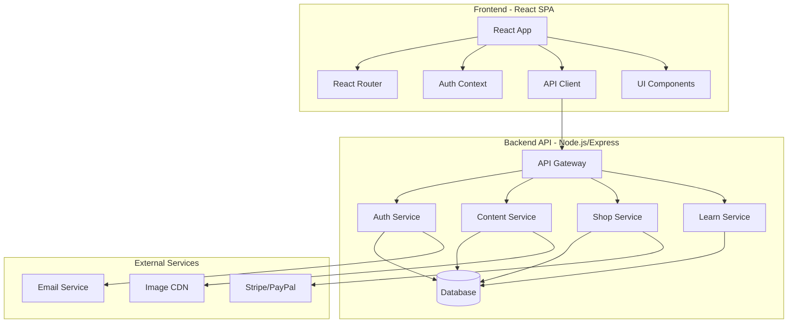

# Design Document

## Overview

This design document outlines the technical architecture and implementation strategy for elevating the portfolio website to world-class standards. The design maintains the existing aesthetic (right-aligned navigation, Ghana flag icon, dark/light page themes) while introducing professional-grade improvements in performance, accessibility, authentication, e-commerce, and content management.

### Design Principles

1. **Progressive Enhancement** - Core functionality works without JavaScript, enhanced features layer on top
2. **Performance First** - Every decision optimized for speed and efficiency
3. **Accessibility by Default** - WCAG 2.1 AA compliance built into every component
4. **Delightful Interactions** - Subtle animations and micro-interactions that enhance UX
5. **Maintainable Architecture** - Clean separation of concerns, reusable patterns

## Architecture

### High-Level System Architecture



### Technology Stack

**Frontend:**
- React 19.1.1 with React Router DOM 7.8.2
- Tailwind CSS 3.4.17 for styling
- Vite 7.1.2 for build tooling
- React Context API for global state management
- Axios for HTTP requests

**Backend:**
- Node.js with Express.js
- PostgreSQL for relational data (users, orders, content)
- JWT for authentication tokens
- bcrypt for password hashing
- Multer for file uploads
- Stripe SDK for payment processing

**Infrastructure:**
- CDN for static assets (Cloudflare/Vercel)
- Image optimization service (Cloudinary/ImageKit)
- Email service (SendGrid/Mailgun)

## Components and Interfaces

### Frontend Component Architecture

#### 1. Authentication Components

**AnimatedLoginForm Component**
```jsx
<AnimatedLoginForm 
  onSuccess={(user) => void}
  redirectTo={string}
/>
```

Features:
- Animated bear character that reacts to form interactions
- Bear covers eyes when password field is focused
- Bear looks at email field when focused
- Bear shows happy/sad expressions based on auth result
- Smooth CSS animations using transforms
- Accessible with proper ARIA labels

**AuthContext Provider**
```jsx
const AuthContext = {
  user: User | null,
  isAuthenticated: boolean,
  isLoading: boolean,
  login: (email, password) => Promise<User>,
  register: (email, password, displayName) => Promise<User>,
  logout: () => Promise<void>,
  refreshToken: () => Promise<void>
}
```

**ProtectedRoute Component**
```jsx
<ProtectedRoute 
  component={Component}
  redirectTo="/login"
  requireAuth={true}
/>
```

#### 2. E-commerce Components (Coming Soon State)

**ShopComingSoon Component**
```jsx
<ShopComingSoon
  gifUrl="/images/coming-soon.gif"
  message="Shop opening soon!"
  notifyMe={boolean}
/>
```

Note: The shop page will maintain its "Coming Soon" state with the existing GIF. E-commerce functionality will be implemented in a future phase. The backend infrastructure will be built but not activated on the frontend until ready.

**Future E-commerce Components** (Not implemented yet):
- ProductCard
- ShoppingCart  
- CheckoutFlow
- StripePaymentForm

#### 3. Content Management Components

**ContentList Component** (Reusable for Projects/Thoughts/Work)
```jsx
<ContentList
  items={ContentItem[]}
  loading={boolean}
  error={Error | null}
  onLoadMore={() => void}
  renderItem={(item) => ReactNode}
/>
```

**SkeletonLoader Component**
```jsx
<SkeletonLoader
  type={'card' | 'list' | 'text'}
  count={number}
/>
```

**ErrorBoundary Component**
```jsx
<ErrorBoundary
  fallback={(error, reset) => ReactNode}
  onError={(error, errorInfo) => void}
/>
```

#### 4. Learn Platform Components (Odin Project Style)

**LessonView Component**
```jsx
<LessonView
  lesson={Lesson}
  onComplete={() => void}
  isCompleted={boolean}
/>
```

**AssignmentSubmissionForm Component**
```jsx
<AssignmentSubmissionForm
  assignment={Assignment}
  existingSubmission={Submission | null}
  onSubmit={(data) => void}
/>
```

Fields:
- GitHub Repository URL (optional)
- Live Preview URL (optional)
- Notes/Description (optional)
- Make submission public checkbox

**SubmissionsList Component**
```jsx
<SubmissionsList
  assignmentId={string}
  submissions={Submission[]}
  currentUserId={string}
  onComment={(submissionId, comment) => void}
/>
```

Features:
- Display all public submissions from students
- Show GitHub repo links and live preview links
- Allow commenting on submissions
- Highlight current user's submission

**StudentProgress Component**
```jsx
<StudentProgress
  courseId={string}
  completedLessons={string[]}
  totalLessons={number}
/>
```

**ProjectsRepoPage Component** (Enhanced)
```jsx
<ProjectsRepoPage
  assignments={Assignment[]}
  mySubmissions={Submission[]}
  onSubmit={(assignmentId, data) => void}
/>
```

Features:
- List all assignments with due dates
- Show submission status for each
- Quick submit/edit functionality
- View other students' submissions

#### 5. Enhanced UI Components

**PageHeader Component** (Enhanced)
- Maintains right-aligned navigation
- Adds smooth scroll-based header behavior
- Implements focus indicators for accessibility
- Adds active page visual feedback
- Preserves Ghana flag icon

**AnimatedPageTransition Component**
```jsx
<AnimatedPageTransition
  duration={300}
  type={'fade' | 'slide'}
/>
```

**Toast Notification System**
```jsx
const toast = {
  success: (message) => void,
  error: (message) => void,
  info: (message) => void,
  warning: (message) => void
}
```

### Backend API Endpoints

#### Authentication Endpoints

```
POST   /api/auth/register
POST   /api/auth/login
POST   /api/auth/logout
POST   /api/auth/refresh
POST   /api/auth/forgot-password
POST   /api/auth/reset-password
GET    /api/auth/me
```

#### Content Management Endpoints

```
GET    /api/projects?page=1&limit=10&featured=true
GET    /api/projects/:id
POST   /api/projects (admin only)
PUT    /api/projects/:id (admin only)
DELETE /api/projects/:id (admin only)

GET    /api/thoughts?page=1&limit=10&featured=true
GET    /api/thoughts/:id
POST   /api/thoughts (admin only)
PUT    /api/thoughts/:id (admin only)
DELETE /api/thoughts/:id (admin only)

GET    /api/work
POST   /api/work (admin only)
PUT    /api/work/:id (admin only)
DELETE /api/work/:id (admin only)
```

#### Shop Endpoints

```
GET    /api/products?page=1&limit=20&category=string
GET    /api/products/:id
POST   /api/products (admin only)
PUT    /api/products/:id (admin only)
DELETE /api/products/:id (admin only)

GET    /api/cart (authenticated)
POST   /api/cart/items (authenticated)
PUT    /api/cart/items/:id (authenticated)
DELETE /api/cart/items/:id (authenticated)

POST   /api/orders (authenticated)
GET    /api/orders (authenticated)
GET    /api/orders/:id (authenticated)
```

#### Payment Endpoints

```
POST   /api/payments/create-intent (authenticated)
POST   /api/payments/confirm (authenticated)
POST   /api/payments/webhook (Stripe webhook)
```

#### Learn Platform Endpoints (Odin Project Style)

```
GET    /api/courses (authenticated)
GET    /api/courses/:id (authenticated)
POST   /api/courses/:id/enroll (authenticated)
GET    /api/courses/:id/progress (authenticated)
PUT    /api/lessons/:id/complete (authenticated)

GET    /api/assignments/:id (authenticated)
POST   /api/assignments/:id/submit (authenticated student)
PUT    /api/submissions/:id (authenticated student - own submission)
DELETE /api/submissions/:id (authenticated student - own submission)
GET    /api/assignments/:id/submissions (authenticated - public submissions)
GET    /api/submissions/my-submissions (authenticated student)

POST   /api/submissions/:id/comments (authenticated)
GET    /api/submissions/:id/comments (authenticated)
```

## Data Models

### User Model

```typescript
interface User {
  id: string;
  email: string;
  passwordHash: string;
  displayName: string;
  role: 'user' | 'student' | 'instructor' | 'admin';
  createdAt: Date;
  updatedAt: Date;
  emailVerified: boolean;
  lastLogin: Date;
}
```

### Product Model

```typescript
interface Product {
  id: string;
  title: string;
  description: string;
  price: number;
  currency: string;
  images: string[];
  category: string;
  stock: number;
  featured: boolean;
  createdAt: Date;
  updatedAt: Date;
}
```

### Cart Model

```typescript
interface Cart {
  id: string;
  userId: string;
  items: CartItem[];
  updatedAt: Date;
}

interface CartItem {
  id: string;
  productId: string;
  quantity: number;
  price: number;
}
```

### Order Model

```typescript
interface Order {
  id: string;
  userId: string;
  items: OrderItem[];
  subtotal: number;
  tax: number;
  shipping: number;
  total: number;
  status: 'pending' | 'processing' | 'shipped' | 'delivered' | 'cancelled';
  shippingAddress: Address;
  paymentIntentId: string;
  createdAt: Date;
  updatedAt: Date;
}

interface OrderItem {
  productId: string;
  title: string;
  quantity: number;
  price: number;
}

interface Address {
  line1: string;
  line2?: string;
  city: string;
  state: string;
  postalCode: string;
  country: string;
}
```

### Content Models

```typescript
interface Project {
  id: string;
  title: string;
  description: string;
  longDescription?: string;
  images: string[];
  technologies: string[];
  githubUrl?: string;
  liveUrl?: string;
  featured: boolean;
  createdAt: Date;
  updatedAt: Date;
}

interface Thought {
  id: string;
  title: string;
  snippet: string;
  content: string;
  date: Date;
  featured: boolean;
  tags: string[];
  createdAt: Date;
  updatedAt: Date;
}

interface WorkExperience {
  id: string;
  company: string;
  position: string;
  description: string;
  startDate: Date;
  endDate?: Date;
  current: boolean;
  technologies: string[];
  order: number;
}
```

### Learn Platform Models (Odin Project Style)

```typescript
interface Course {
  id: string;
  title: string;
  description: string;
  instructorId: string;
  lessons: Lesson[];
  createdAt: Date;
  updatedAt: Date;
}

interface Lesson {
  id: string;
  courseId: string;
  title: string;
  content: string;
  videoUrl?: string;
  order: number;
  assignments: Assignment[];
}

interface Enrollment {
  id: string;
  userId: string;
  courseId: string;
  completedLessons: string[];
  enrolledAt: Date;
  lastAccessedAt: Date;
}

interface Assignment {
  id: string;
  lessonId: string;
  title: string;
  description: string;
  instructions: string;
  type: 'project' | 'exercise' | 'reading';
  dueDate?: Date;
  required: boolean;
}

interface Submission {
  id: string;
  assignmentId: string;
  studentId: string;
  studentName: string;
  githubRepoUrl?: string;
  livePreviewUrl?: string;
  notes?: string;
  submittedAt: Date;
  updatedAt: Date;
  isPublic: boolean; // Allow students to see each other's work
}

interface SubmissionComment {
  id: string;
  submissionId: string;
  userId: string;
  userName: string;
  content: string;
  createdAt: Date;
}
```

## Error Handling

### Frontend Error Handling Strategy

**1. Error Boundaries**
- Wrap each major section (pages, complex components) in error boundaries
- Provide contextual fallback UI with recovery options
- Log errors to monitoring service (Sentry/LogRocket)

**2. API Error Handling**
```typescript
interface APIError {
  message: string;
  code: string;
  field?: string;
  statusCode: number;
}

// Centralized error handler
const handleAPIError = (error: APIError) => {
  switch (error.statusCode) {
    case 401:
      // Redirect to login
      break;
    case 403:
      // Show permission denied
      break;
    case 404:
      // Show not found
      break;
    case 422:
      // Show validation errors
      break;
    case 500:
      // Show generic error with retry
      break;
  }
}
```

**3. Form Validation Errors**
- Display inline field errors
- Highlight invalid fields with red borders
- Provide helpful error messages
- Prevent submission until valid

**4. Network Errors**
- Detect offline state
- Show offline banner
- Queue requests for retry
- Provide manual retry button

### Backend Error Handling

**1. Validation Errors**
```javascript
{
  "error": "Validation failed",
  "code": "VALIDATION_ERROR",
  "fields": {
    "email": "Invalid email format",
    "password": "Password must be at least 8 characters"
  }
}
```

**2. Authentication Errors**
```javascript
{
  "error": "Invalid credentials",
  "code": "AUTH_FAILED",
  "statusCode": 401
}
```

**3. Rate Limiting**
```javascript
{
  "error": "Too many requests",
  "code": "RATE_LIMIT_EXCEEDED",
  "retryAfter": 60
}
```

**4. Server Errors**
- Log full error details server-side
- Return generic message to client
- Include request ID for debugging

## Testing Strategy

### Frontend Testing

**1. Unit Tests**
- Test utility functions and hooks
- Test component logic in isolation
- Use React Testing Library
- Aim for 80%+ coverage on critical paths

**2. Integration Tests**
- Test user flows (login, checkout, etc.)
- Test API integration with mocked responses
- Test form submissions and validations

**3. Accessibility Tests**
- Use jest-axe for automated a11y testing
- Test keyboard navigation
- Test screen reader compatibility

**4. Visual Regression Tests**
- Snapshot tests for critical components
- Test responsive breakpoints
- Test dark/light themes

### Backend Testing

**1. Unit Tests**
- Test business logic functions
- Test data validation
- Test utility functions

**2. Integration Tests**
- Test API endpoints
- Test database operations
- Test authentication flows

**3. E2E Tests**
- Test complete user journeys
- Test payment flows (with test mode)
- Test email sending

### Performance Testing

**1. Lighthouse CI**
- Run on every PR
- Enforce minimum scores (Performance: 90, Accessibility: 100, Best Practices: 90, SEO: 90)

**2. Bundle Size Monitoring**
- Track bundle size changes
- Alert on significant increases
- Use webpack-bundle-analyzer

**3. Load Testing**
- Test API endpoints under load
- Test concurrent user scenarios
- Identify bottlenecks

## Performance Optimization Strategy

### Frontend Optimizations

**1. Code Splitting**
```javascript
// Route-based code splitting
const Projects = lazy(() => import('./pages/Projects'));
const Shop = lazy(() => import('./pages/Shop'));
const Learn = lazy(() => import('./pages/Learn'));
```

**2. Image Optimization**
- Use WebP/AVIF formats with fallbacks
- Implement lazy loading with Intersection Observer
- Use responsive images with srcset
- Compress images before upload

**3. Font Optimization**
- Use font-display: swap
- Subset fonts to include only needed characters
- Preload critical fonts
- Use system fonts as fallback

**4. Caching Strategy**
- Cache API responses with SWR or React Query
- Use service worker for offline support
- Implement stale-while-revalidate pattern

**5. React Optimizations**
- Use React.memo() for expensive components
- Implement virtualization for long lists
- Debounce search inputs
- Use useCallback and useMemo appropriately

### Backend Optimizations

**1. Database Optimization**
- Add indexes on frequently queried fields
- Use connection pooling
- Implement query result caching (Redis)
- Optimize N+1 queries

**2. API Response Optimization**
- Implement pagination
- Use field selection (GraphQL-style)
- Compress responses with gzip/brotli
- Implement ETags for caching

**3. CDN Strategy**
- Serve static assets from CDN
- Use edge caching for API responses
- Implement geographic distribution

## Security Considerations

### Authentication Security

**1. Password Security**
- Hash passwords with bcrypt (cost factor 12)
- Enforce minimum password requirements
- Implement password strength meter
- Support password reset flow

**2. Token Security**
- Use JWT with short expiration (15 minutes)
- Implement refresh tokens (7 days)
- Store tokens in httpOnly cookies
- Implement token rotation

**3. Session Security**
- Implement CSRF protection
- Use secure, httpOnly, sameSite cookies
- Implement session timeout
- Log security events

### API Security

**1. Input Validation**
- Validate all inputs server-side
- Sanitize user-generated content
- Use parameterized queries (prevent SQL injection)
- Implement rate limiting

**2. Authorization**
- Implement role-based access control (RBAC)
- Verify permissions on every request
- Use principle of least privilege

**3. HTTPS**
- Enforce HTTPS in production
- Use HSTS headers
- Implement certificate pinning

### Payment Security

**1. PCI Compliance**
- Never store card details
- Use Stripe Elements for card input
- Implement 3D Secure
- Log payment events

**2. Fraud Prevention**
- Implement address verification
- Monitor for suspicious patterns
- Use Stripe Radar for fraud detection

## Accessibility Implementation

### Keyboard Navigation

**Focus Management**
- Visible focus indicators (2px outline)
- Logical tab order
- Skip links for main content
- Focus trapping in modals

**Keyboard Shortcuts**
- Escape to close modals
- Arrow keys for navigation
- Enter/Space for activation

### Screen Reader Support

**Semantic HTML**
- Use proper heading hierarchy
- Use landmark regions (nav, main, aside, footer)
- Use lists for navigation
- Use buttons for actions, links for navigation

**ARIA Labels**
- Add aria-label for icon buttons
- Use aria-describedby for form hints
- Implement aria-live regions for dynamic content
- Use aria-expanded for collapsible sections

### Color and Contrast

**Contrast Ratios**
- Normal text: 4.5:1 minimum
- Large text: 3:1 minimum
- UI components: 3:1 minimum

**Color Independence**
- Don't rely solely on color for information
- Use icons + text for status
- Use patterns in addition to colors

### Motion and Animation

**Respect User Preferences**
```css
@media (prefers-reduced-motion: reduce) {
  * {
    animation-duration: 0.01ms !important;
    animation-iteration-count: 1 !important;
    transition-duration: 0.01ms !important;
  }
}
```

## Deployment Strategy

### Build Process

**1. Production Build**
```bash
npm run build
# - Minify JavaScript
# - Optimize CSS
# - Compress images
# - Generate source maps
# - Create bundle analysis report
```

**2. Environment Variables**
```
VITE_API_URL=https://api.example.com
VITE_STRIPE_PUBLIC_KEY=pk_live_xxx
VITE_GEMINI_API_KEY=xxx
```

### Deployment Pipeline

**1. CI/CD Workflow**
- Run linter on PR
- Run tests on PR
- Run Lighthouse CI
- Deploy preview on PR
- Deploy to production on merge to main

**2. Hosting**
- Frontend: Vercel/Netlify
- Backend: Railway/Render/AWS
- Database: Supabase/PlanetScale/AWS RDS
- CDN: Cloudflare

### Monitoring

**1. Error Tracking**
- Sentry for error monitoring
- Track error rates and patterns
- Alert on critical errors

**2. Performance Monitoring**
- Track Core Web Vitals
- Monitor API response times
- Track user interactions

**3. Analytics**
- Track page views
- Track conversion funnel
- Monitor user behavior

## Migration Strategy

### Phase 1: Foundation (Weeks 1-2)
- Set up backend API structure
- Implement authentication system
- Create database schema
- Set up CI/CD pipeline

### Phase 2: Content Management (Weeks 3-4)
- Migrate hardcoded content to database
- Implement content API endpoints
- Update frontend to fetch from API
- Add loading states and error handling

### Phase 3: E-commerce (Weeks 5-7)
- Implement product management
- Build shopping cart functionality
- Integrate Stripe payment
- Implement order management

### Phase 4: Learn Platform (Weeks 8-9)
- Implement course structure
- Build assignment submission
- Add progress tracking
- Implement instructor features

### Phase 5: Polish & Optimization (Weeks 10-12)
- Performance optimization
- Accessibility audit and fixes
- Animation and micro-interactions
- SEO optimization
- Security audit
- Load testing

### Phase 6: Launch (Week 13)
- Final testing
- Production deployment
- Monitoring setup
- Documentation
